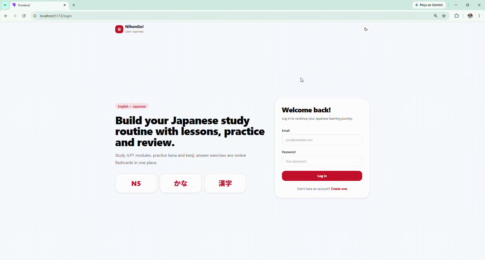

# NihonGo!

A full-stack Japanese learning platform for English speakers, with JLPT lessons, interactive exercises, kana and kanji practice, flashcards, and progress tracking.



## Try It

**Live demo:** [Try NihonGo!](https://nihon-go-jp.vercel.app/)

For local testing:

```txt
Frontend: http://localhost:5173
Backend:  http://localhost:3001
```

## Quick Start

```bash
cd backend
npm install
npm run db:migrate
npx sequelize-cli db:seed --seed 20260621185137-seed-initial-content.js
npm run dev
```

In a second terminal:

```bash
cd frontend
npm install
npm run dev
```

Open:

```txt
http://localhost:5173
```

## Features

- Account registration and login with JWT authentication.
- Dashboard with learning progress, daily goal data, recent activity, and next lesson recommendation.
- JLPT module flow with N5 beginner lessons and interactive exercises.
- Exercise answer checking with explanations and per-lesson progress tracking.
- Hiragana, katakana, and N5 kanji trainer with instant feedback.
- Flashcard deck and card management, including due-card review scheduling.
- Light and dark theme support.

## What You Can Learn With It

NihonGo! currently focuses on beginner Japanese content for English speakers:

- N5 grammar basics such as `は`, `を`, `に`, `の`, `です`, `ます`, and `か`.
- Hiragana and katakana practice beyond the vowel row.
- N5 kanji such as `日`, `人`, `水`, `火`, `木`, `月`, `山`, `川`, and more.
- Flashcard review for vocabulary, kanji, and beginner phrases.

## Tech Stack

### Frontend

- React
- Vite
- React Router
- TanStack Query
- Axios
- Tailwind CSS
- Lucide React
- Oxlint

### Backend

- Node.js
- Express
- PostgreSQL
- Sequelize
- Sequelize CLI
- JWT
- bcrypt
- Zod
- Helmet
- CORS
- express-rate-limit
- Jest
- Supertest

## How It Works

NihonGo! is split into a React frontend and an Express REST API.

The backend follows a layered structure:

```txt
routes -> controllers -> services -> models
```

Routes define API endpoints, controllers handle request/response behavior, services contain business logic, and Sequelize models represent database tables. This keeps learning content, user progress, trainer practice, and flashcard review logic separated from UI concerns.

The learning system is built around modules, lessons, exercises, and progress records. Public content can be loaded without a user token, while progress and review routes require authentication. This lets the app show general learning content while still tracking each learner's answers, completed lessons, practiced characters, and flashcard review history.

The trainer uses a shared `study_characters` table for hiragana, katakana, and kanji. Flashcards are stored separately from flashcard reviews, so the same card can have user-specific mastery, review count, and due-date data.

## Requirements

- Node.js 18 or newer
- npm
- PostgreSQL

## Environment Variables

Create `backend/.env`:

```env
PORT=3001

DB_HOST=localhost
DB_PORT=5432
DB_NAME=nihongo_db
DB_USER=your_db_user
DB_PASSWORD=your_db_password

JWT_SECRET=your_jwt_secret
JWT_EXPIRES_IN=1d

NODE_ENV=development

FRONTEND_URL=http://localhost:5173

RATE_LIMIT_WINDOW_MS=900000
RATE_LIMIT_MAX=1000
AUTH_RATE_LIMIT_MAX=50
```

Create `frontend/.env`:

```env
VITE_API_URL=http://localhost:3001
```

## Local Development

### 1. Backend

```bash
cd backend
npm install
npm run db:migrate
```

Run only the seeders you need. For a fresh database, start with:

```bash
npx sequelize-cli db:seed --seed 20260621185137-seed-initial-content.js
npx sequelize-cli db:seed --seed 20260627001221-seed-study-characters.js
npx sequelize-cli db:seed --seed 20260628222604-seed-flashcards.js
npx sequelize-cli db:seed --seed 20260710231952-seed-more-kana.js
npx sequelize-cli db:seed --seed 20260710232654-seed-more-n5-kanji.js
npx sequelize-cli db:seed --seed 20260711002534-seed-more-n5-lessons.js
```

Start the API:

```bash
npm run dev
```

### 2. Frontend

```bash
cd frontend
npm install
npm run dev
```

## Useful Scripts

### Backend

```bash
npm run dev
npm start
npm test
npm run db:migrate
npm run db:migrate:undo
npm run db:seed
npm run db:seed:undo
```

Note: `npm run db:seed` runs every seeder. On an existing database, prefer running individual seeders with `npx sequelize-cli db:seed --seed FILE_NAME.js`.

### Frontend

```bash
npm run dev
npm run lint
npm run build
npm run check
npm run preview
```

## Main API Routes

### Auth

```txt
POST /api/auth/register
POST /api/auth/login
GET  /api/auth/me
```

### Content

```txt
GET /api/content/modules
GET /api/content/modules/:id
GET /api/content/lessons/:id
GET /api/content/lessons/:id/exercises
```

### Progress

```txt
POST /api/progress/exercises/:id/answer
GET  /api/progress/lessons/:id
GET  /api/progress/modules/:id
GET  /api/progress/overview
```

### Trainer

```txt
GET  /api/trainer/characters
GET  /api/trainer/characters/random
POST /api/trainer/characters/:id/answer
GET  /api/trainer/progress
```

### Flashcards

```txt
POST   /api/flashcards/decks
GET    /api/flashcards/decks
GET    /api/flashcards/decks/:id
PUT    /api/flashcards/decks/:id
DELETE /api/flashcards/decks/:id

POST   /api/flashcards/decks/:deckId/cards
PUT    /api/flashcards/cards/:id
DELETE /api/flashcards/cards/:id

GET    /api/flashcards/due
POST   /api/flashcards/cards/:id/review
GET    /api/flashcards/progress
```

### Dashboard

```txt
GET /api/dashboard/summary
```

## Validation

Run backend tests:

```bash
cd backend
npm test
```

Run frontend checks:

```bash
cd frontend
npm run check
```

## Credits

Built by Arthur Manenti.

AI assistance was used to plan parts of the architecture, improve documentation structure, and iterate on implementation details.
